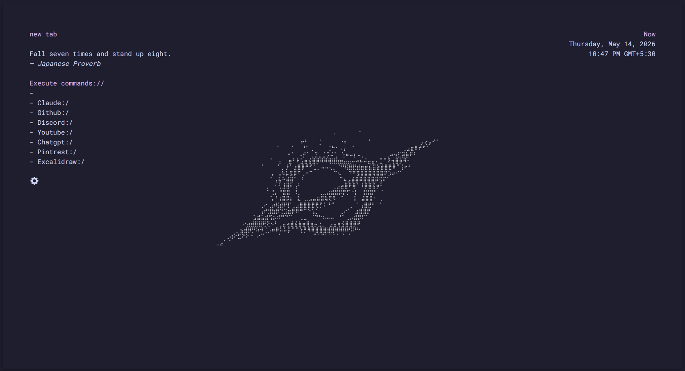
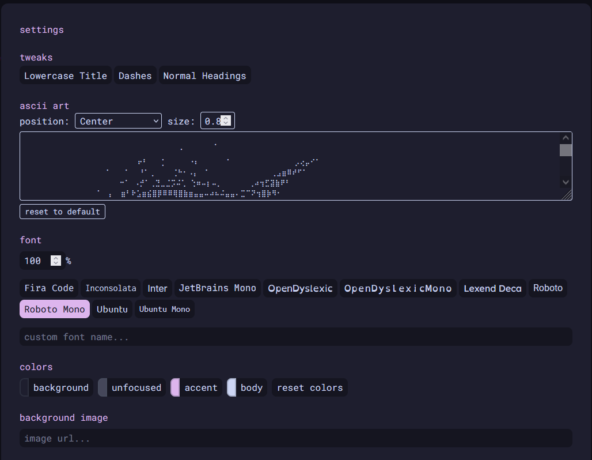
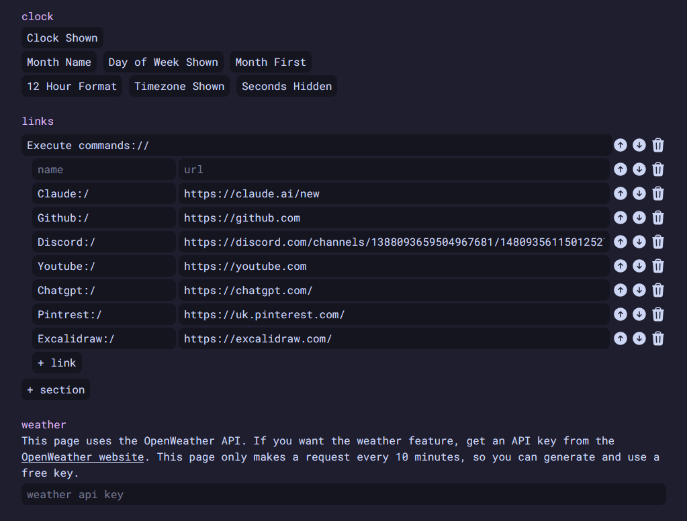
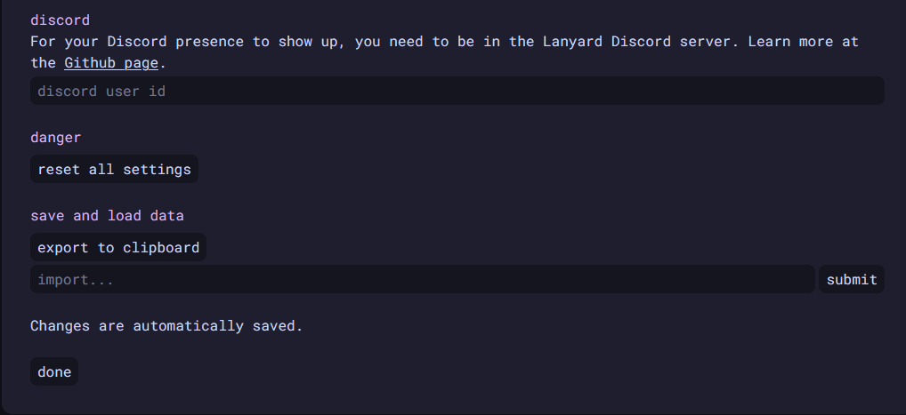

# Simple New Tab (Enhanced)

A modern, highly customizable new tab extension built on top of the original **Simple New Tab** project.

This fork focuses on expanding customization, personalization, and quality-of-life features while preserving the clean and minimal design philosophy of the original project.

> **Current Status:** Pre-release

---


## Preview

<p align="center">
  
</p>

**Main Interface**  
The default landing page featuring customizable ASCII art, live clock, dynamic quotes, and quick-access links.

---

<p align="center">
  
</p>

**General Settings**  
Customize interface behavior, text styling, headings, accent colors, and visual preferences.

---

<p align="center">
  
</p>

**ASCII Customization**  
Edit, reposition, resize, recolor, or completely replace the center ASCII artwork.

---

<p align="center">
  
</p>

**Advanced Customization**  
Manage links, background images, fonts, integrations, and backup settings.

## Features

### Default Interface

- Clean and minimal new tab experience
- Fully customizable ASCII art display
- Dynamic quote generator
- Live clock with:
  - Current time
  - Date
  - Day of the week
- Pre-configured quick links
- Secondary customizable link sections

### Customization

#### Interface Tweaks

Customize:

- Lowercase titles
- Dash styling
- Standard headings
- Accent colors
- Text colors
- Background colors
- Inactive UI styling

#### ASCII Editor

Built-in ASCII editor with support for:

- Resize
- Reposition
- Recolor
- Reset to default
- Custom ASCII input

#### Font Support

Included fonts:

- Fira Code
- Inconsolata
- JetBrains Mono
- OpenDyslexic
- Roboto Mono

Also supports custom fonts.

#### Background Support

- Set custom background images using image URLs

---

## Integrations

### Weather

Powered by OpenWeather API.

Features:

- Live weather information
- Personal API key support

### Discord Presence

Powered by Lanyard.

Features:

- Live Discord status
- Activity display
- User ID support

---

## Link Management

Create and customize your own sections:

- Create categories
- Rename sections
- Reorder links
- Change colors
- Delete shortcuts

---

## Data & Backup

- Export settings to clipboard
- Import saved configurations
- Automatic real-time saving
- Full reset through Danger Zone

---

## Installation

### Firefox (Pre-release)

> This extension is currently in pre-release and must be installed manually.

1. Download the latest release `.zip`
2. Extract the archive
3. Open `about:debugging` in Firefox
4. Select **This Firefox**
5. Click **Load Temporary Add-on**
6. Navigate to the extracted folder
7. Select `manifest.json`

> **Note:** Firefox will require you to reload the extension after every full browser restart until official publication.

---

### Chromium Browsers

Chromium support is currently in development.

---

## Development

Install dependencies:

```bash
pnpm install
```

Start development server:

```bash
pnpm dev
```

---

## Build

Build the extension:

```bash
pnpm build
```

Output folder:

```bash
/dist
```

---

## Credits

Original project: Simple New Tab

Enhanced fork and additional features by VK-MKI

---

## Transparency

Parts of the project documentation were drafted with AI assistance and reviewed/edited manually for clarity and accuracy.

---

## Project Status

This project is actively being developed. More features, polish, and browser support improvements are planned.
